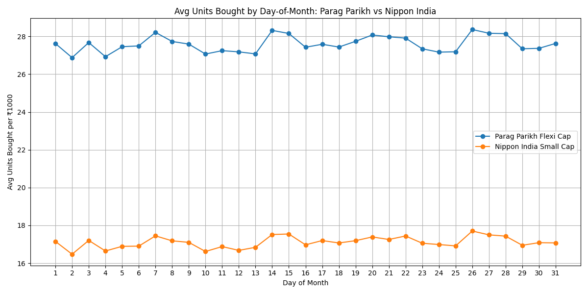

# Does the Day of the Month You Invest Your SIP Actually Matter?

A data analysis project exploring whether the day of the month you invest your SIP affects the units you accumulate, using 10 years of daily NAV data for two Indian mutual funds — **Parag Parikh Flexi Cap Fund** and **Nippon India Small Cap Fund**.

## 📋 Table of Contents
- [Overview](#overview)
- [Data Source](#data-source)
- [Methodology](#methodology)
- [How to Run](#how-to-run)
- [Results](#results)
- [Key Takeaway](#key-takeaway)
- [Repo Structure](#repo-structure)
- [Disclaimer](#disclaimer)

## Overview
Like many SIP investors, I wondered: does it matter *which* day of the month you invest? Since NAV fluctuates daily, could consistently investing on a specific day (say, the 8th vs the 25th) lead to buying more units on average over time?

Instead of guessing, I decided to test it with real historical data — simulating a daily ₹1000 investment across two popular mutual funds over a 10-year period, then grouping results by day-of-month to see if any pattern emerged.

## Data Source
- NAV data sourced from [mfapi.in](https://www.mfapi.in), which mirrors data published by **AMFI** (Association of Mutual Funds in India)
- Funds analyzed:
  - **Parag Parikh Flexi Cap Fund** – Direct Plan, Growth Option
  - **Nippon India Small Cap Fund** – Growth Plan, Growth Option (Scheme Code: 113177)
- Date range covered: **07-07-2016 to 03-07-2026** (~10 years of daily NAV data)

## Methodology
1. Simulated investing a fixed ₹1000 on every single trading day across the full date range
2. Calculated units bought each day using that day's own NAV (`Units = Amount ÷ NAV`)
3. Grouped all trading days by **day-of-month** (1st, 2nd, 3rd ... up to 31st) across all 10 years
4. Calculated the **total units** and **average units per occurrence** for each day-of-month
5. Compared the day-of-month patterns across both funds using a line graph

## How to Run
**Requirements:**
```bash
pip install requests matplotlib
```

**Steps:**
1. Clone this repo
2. Run the script (Google Colab or local Python environment):
```bash
   python sip_simulator.py
```
3. The script will prompt for:
   - Mutual fund name (or use pre-set scheme code)
   - Number of years / date range
   - Daily investment amount
4. Output: a combined CSV with daily NAV/units data and a day-of-month summary table, plus a comparison line graph

## Results


- Both funds showed some variation in average units bought across different days of the month
- The "best" and "worst" days differed slightly between the two funds
- Sample size per day-of-month bucket was roughly 90–100 occurrences across the 10-year period

*(See `sample_output/` for the full data behind this chart)*

## Key Takeaway
While the data does show some difference between "best" and "worst" days, **this is very likely statistical noise, not a real pattern**, for a few reasons:

- There's no causal mechanism linking a calendar date to NAV movement — markets don't "know" what day of the month it is
- Each day-of-month bucket only has ~90–100 data points spread across 10 years — a small sample size
- Testing 28–31 different "buckets" means *some* day is guaranteed to look like a "winner" purely by chance (a classic multiple-comparisons effect)
- The spread between the best and worst days is small relative to typical day-to-day NAV volatility

**The real, well-supported takeaway for SIP investors**: consistency and staying invested matter far more than which specific day you choose. Time in the market beats timing the market.

## Repo Structure
├── README.md
├── sip_simulator.py
├── requirements.txt
├── sample_output/
│   ├── parag_parikh_sample.csv
│   └── nippon_india_sample.csv
└── charts/
    └── day_of_month_comparison.png
## Disclaimer
This is a personal data exploration project, **not financial advice**. Past NAV patterns do not predict future fund performance. Please verify any data independently and consult a qualified financial advisor before making investment decisions.

---

*Data source: [mfapi.in](https://www.mfapi.in) (AMFI data)*
